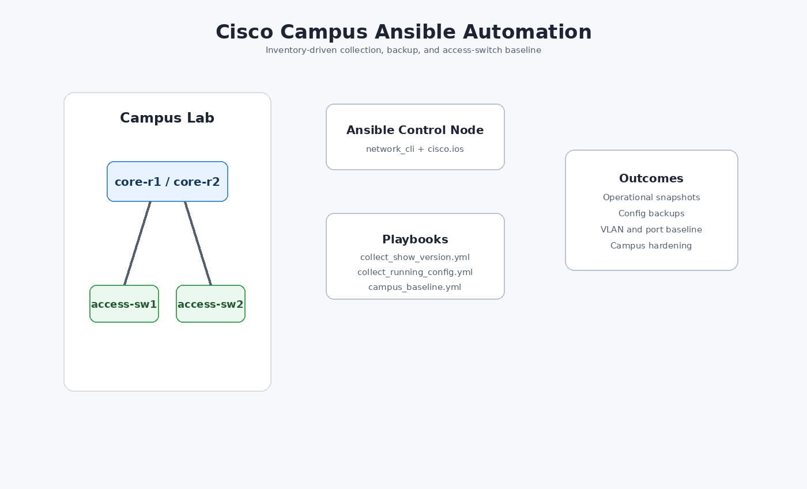

# Network Automation Portfolio

A curated portfolio repo showing practical NetDevOps work across Cisco Ansible automation, Juniper PyEZ scripts, and Juniper Ansible/Jinja workflows.

The source material came from retired lab and automation folders. This public version is intentionally cleaned up: credentials are pulled from environment variables, lab IPs use documentation ranges, generated output is excluded, and scripts include guardrails around disruptive operations.

## Sections

| Section | Focus | Highlights |
| --- | --- | --- |
| `cisco-ansible-campus` | Cisco IOS campus lab automation | Show-command collection, config backup, access-switch baseline, security hardening |
| `network-discovery` | Multi-vendor Ansible discovery and SNMP baseline | Structured CDP/LLDP/ARP parsing, topology edge generation, ARP vendor enrichment, SNMPv3 IOS/NX-OS examples |
| `legacy-and-api-automation` | API, legacy firewall, Netmiko, NAPALM, and remediation examples | Meraki reporting, ScreenOS SSH automation, CSV inventory rendering, multi-vendor CLI pushes, interface reporting, IOS/SONiC remediation logic |
| `fortigate-automation` | FortiGate and FortiManager automation | CSV object generation, config export parsing, BGP/IPsec health parsing, FortiManager/ZTP patterns |
| `juniper-automation/pyez` | Junos Python automation | Facts, RPCs, XPath, BGP validation, SCP, rescue config, shell access, config diff/rollback, commit confirmed, reboot/software guardrails |
| `juniper-automation/ansible` | Junos Ansible and Jinja | Facts, command execution, ISIS config rendering, optional commit-confirm deployment |

## Portfolio Story

This repo is designed to show range rather than one narrow workflow:

- Multi-vendor automation: Cisco IOS and Junos.
- Multi-vendor discovery patterns: Cisco IOS, Cisco NX-OS, Huawei VRP style parsing.
- Multiple automation styles: Ansible playbooks, Jinja templates, PyEZ Python scripts.
- API and legacy automation patterns: Meraki Dashboard, ScreenOS/SSG, Netmiko, NAPALM.
- Firewall automation patterns: FortiGate configuration generation/parsing and FortiManager ZTP orchestration.
- Operational safety: dry-run defaults, check mode, commit confirmed, explicit confirmation flags.
- Public-safe hygiene: no real credentials, no raw device outputs, no private URLs, no public-routable lab IPs.

## Diagrams

Cisco campus Ansible workflow:



Juniper automation workflow:


## Quick Start

```bash
python3 -m venv .venv
source .venv/bin/activate
pip install -r requirements.txt
```

Cisco examples:

```bash
cd cisco-ansible-campus
ansible-playbook playbooks/collect_show_version.yml --check
ansible-playbook playbooks/campus_baseline.yml --check
```

Network discovery examples:

```bash
cd network-discovery
ansible-playbook playbooks/collect_lldp_structured.yml
ansible-playbook playbooks/configure_snmpv3_ios.yml --check
python parsers/build_topology_edges.py artifacts/lldp --output artifacts/topology_edges.csv
python parsers/enrich_arp_vendors.py sample_arp.csv --output artifacts/arp_enriched.csv --offline
```

Legacy and API automation examples:

```bash
cd legacy-and-api-automation/onboarding
python csv_to_inventory.py sample_devices.csv --output artifacts/generated_inventory.yml

cd ../netmiko_napalm
python netmiko_config_push.py --hosts 192.0.2.31 --device-type cisco_ios --commands 'logging buffered 64000'
python napalm_interface_report.py --hosts 192.0.2.31,192.0.2.32 --driver ios

cd ../remediation
python ios_local_user_cleanup.py --candidate sample_candidate_users.cfg --running sample_running_users.cfg
python sonic_tacacs_sync.py --show-tacacs sample_show_tacacs.txt --json sample_tacacs.json
```

FortiGate automation examples:

```bash
cd fortigate-automation/object-generation
python render_address_objects.py --csv sample_addresses.csv

cd ../config-parsing
python fortigate_config_to_csv.py sample_fortigate.conf --type policy --output artifacts/policies.csv

cd ../operational-health
python parse_health_outputs.py sample_bgp_summary.txt --type bgp --output artifacts/bgp.csv
```

Juniper Ansible examples:

```bash
cd juniper-automation/ansible
ansible-playbook playbooks/get_facts.yml --check
ansible-playbook playbooks/configure_isis_interfaces.yml
```

Juniper PyEZ examples:

```bash
cd juniper-automation/pyez
python show_version.py --host 198.51.100.11
python rpc_queries.py --host 198.51.100.11 interfaces --xpath './/physical-interface/name'
python config_workflow.py --host 198.51.100.11 --config ../ansible/artifacts/isis/core-a_isis_interfaces.conf
```

## Sanitization Notes

- All credentials are expected from environment variables or interactive prompts.
- Example device management IPs use `192.0.2.0/24` and `198.51.100.0/24`.
- Example routed links use `203.0.113.0/24`.
- Runtime artifacts are written under `artifacts/`, which is ignored by Git.
- Legacy `.retry`, raw command output, local logs, generated configs, and backup files were intentionally left out.
