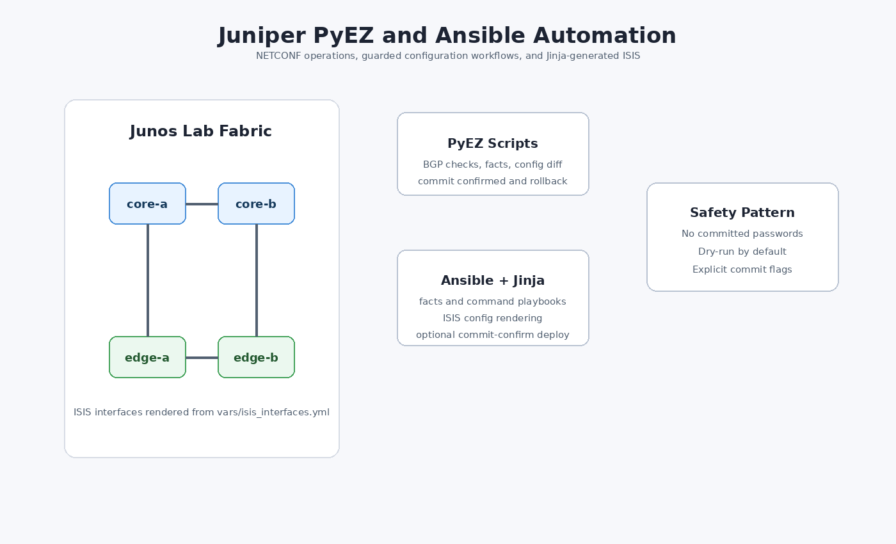

# Juniper Automation

This section contains sanitized Juniper automation examples split into two styles:

- `pyez/`: Python scripts using Juniper PyEZ for operational checks and guarded changes.
- `ansible/`: Ansible playbooks and Jinja templates for Junos facts, command execution, and ISIS interface configuration.

## What It Demonstrates

- NETCONF-based operational collection.
- BGP peer-state validation with PyEZ RPCs.
- Candidate configuration loading, diff preview, rollback, commit check, and commit confirmed.
- Guarded reboot and software install workflows that default to dry-run behavior.
- Ansible/Jinja generation of Junos ISIS set commands from structured variables.

## Demo Topology



## PyEZ Examples

```bash
cd juniper-automation/pyez
export JUNOS_USER=netops
export JUNOS_PASSWORD='example-password'
python show_version.py --host 198.51.100.11
python check_bgp_sessions.py --host 198.51.100.11
python interface_state.py --host 198.51.100.11 ge-0/0/1 disable
python config_workflow.py --host 198.51.100.11 --config ../ansible/artifacts/isis/core-a_isis_interfaces.conf
```

Risky operations require explicit flags such as `--commit`, `--confirm`, or `--reboot`.

## Ansible Examples

```bash
cd juniper-automation/ansible
export JUNOS_USER=netops
export JUNOS_PASSWORD='example-password'
ansible-playbook playbooks/get_facts.yml
ansible-playbook playbooks/execute_commands.yml
ansible-playbook playbooks/configure_isis_interfaces.yml
ansible-playbook playbooks/configure_isis_interfaces.yml -e deploy_changes=true
```

The inventory uses documentation-range IPs from `198.51.100.0/24`, and the ISIS interface addressing uses `203.0.113.0/24` and `192.0.2.0/24` examples.
